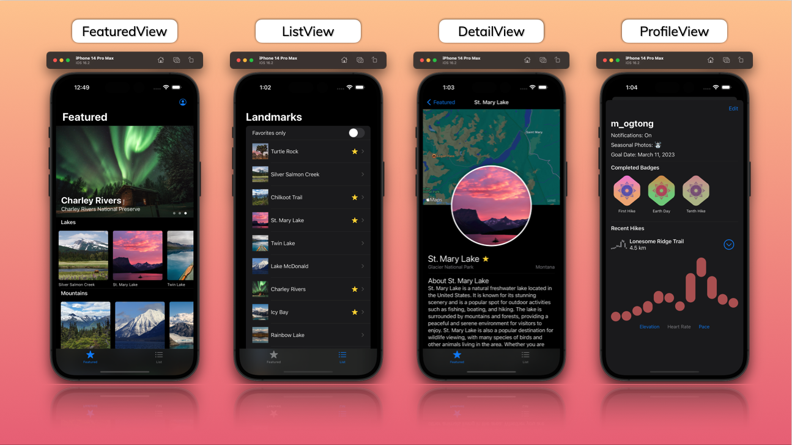

# Landmarks
Landmarks is a versatile travel companion for hikers that has been created through a comprehensive SwiftUI tutorial from Apple. The app utilizes the latest technology, including SwiftUI, UIKit, MapKit, CoreGraphics, CoreLocation, and Combine, to offer an intuitive interface for exploring new destinations.
 
# App Showcase

# Demo

